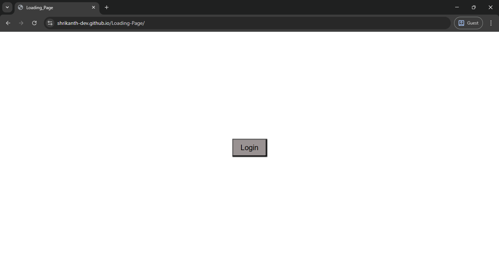
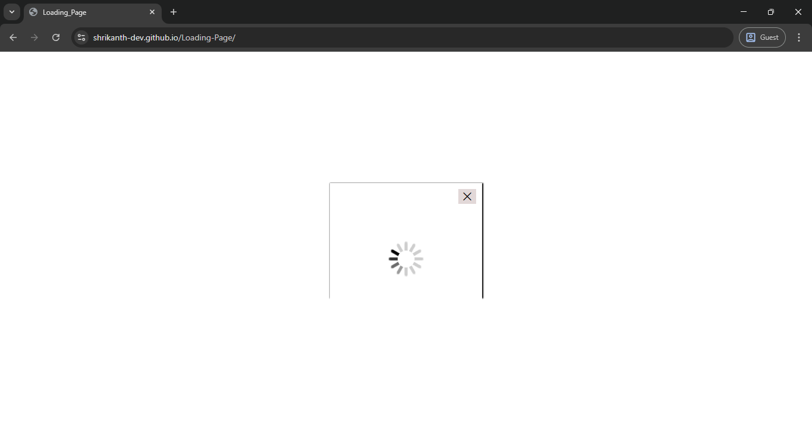

# Loading Page 

## Table of contents

- [Overview](#overview)
  - [The challenge](#the-challenge)
  - [Screenshot](#screenshot)
  - [Links](#links)
  - [Built with](#built-with)
- [Author](#author)

## Overview

A login button loader page demonstrating a popup modal with a loading GIF using HTML, CSS, and Vanilla JavaScript. It uses smooth transitions to animate the popup in and out with a close button, ideal for learning modal transitions and event-driven DOM manipulation.

### The challenge

 Create a popup modal that:

-Appears when the Login button is clicked.

-Shows a loading GIF inside the modal.

-Animates in with scaling and fade transitions.

-Closes on clicking the × close button, animating out smoothly.

### Screenshot

### Links

- Solution URL: [solution URL](https://github.com/shrikanth-dev/Loading-Page)
- Live Site URL: [live site URL](https://shrikanth-dev.github.io/Loading-Page/)

### Built with

-HTML5

-CSS3 (Transitions, Positioning, Modal Styling)

-Vanilla JavaScript

## Author

- Frontend Mentor - [@shrikanth-dev]
- LinkedIn - [@G Srikanth](https://www.linkedin.com/in/g-srikanth-gs)
